# Blink — Implementation Plan

> **Goal**: Build a Chrome extension (React + TypeScript) that automates posting to Facebook groups using browser-level DOM automation — no Meta APIs.

## Resolved Decisions

| Decision | Choice | Rationale |
|---|---|---|
| **UI Surface** | Side Panel (not popup) | Stays open during campaigns for live monitoring |
| **Tab Strategy** | Option A — single dedicated tab, sequential navigation | Simplest, lowest resource usage |
| **ToS Disclaimer** | Minor disclaimer at bottom of Compose screen | Non-intrusive |
| **Extension Name** | Blink | Confirmed |
| **Icons** | Lucide React (`lucide-react`) — no emojis in UI | Tree-shakable SVG icon library |

---

## Overview

The build is split into **6 checkpoints**, each producing a testable, demonstrable increment. Every checkpoint ends with measurable acceptance criteria.

```mermaid
gantt
    title Blink MVP Build Phases
    dateFormat X
    axisFormat %s
    section Foundation
        CP1 - Scaffold & Design System : 0, 1
    section UI Components
        CP2 - Post Composer            : 1, 2
        CP3 - Group List Manager       : 2, 3
    section Core Engine
        CP4 - Background Orchestrator  : 3, 4
        CP5 - Facebook Content Script  : 4, 5
    section Integration
        CP6 - Dashboard & E2E          : 5, 6
```



---

## Checkpoint 1 — Project Scaffold & Design System

> **Goal**: Working build pipeline, extension loads in Chrome, and design system CSS is in place.

### Files to Create

#### [NEW] `package.json`
- Dependencies: `react`, `react-dom`, `zustand`
- Dev dependencies: `vite`, `@vitejs/plugin-react`, `@crxjs/vite-plugin`, `typescript`, `vitest`, `@testing-library/react`, `@testing-library/jest-dom`, `jsdom`, `eslint`, `prettier`
- Scripts: `dev`, `build`, `test`, `test:watch`, `lint`

#### [NEW] `vite.config.ts`
- Vite config with React plugin + CRXJS plugin
- Input configured for popup `index.html`

#### [NEW] `tsconfig.json`
- Strict mode, JSX support, path aliases (`@popup/`, `@background/`, `@content/`, `@shared/`)

#### [NEW] `src/manifest.json`
- Manifest V3 with `storage`, `activeTab`, `scripting`, `tabs` permissions
- Host permissions for `https://*.facebook.com/*`
- Popup entry point, background service worker, content script stub

#### [NEW] `src/sidepanel/index.html` + `src/sidepanel/index.tsx`
- Side panel React mount point

#### [NEW] `src/sidepanel/App.tsx`
- Tab-based layout shell (Compose / Groups / Campaign / Settings)
- Navigation between tabs
- Uses Lucide React icons for all tab icons and UI elements (no emojis)

#### [NEW] `src/sidepanel/styles/variables.css`
- CSS custom properties: color palette (dark theme), spacing scale, typography, border radii, shadows, transitions

#### [NEW] `src/sidepanel/styles/global.css`
- Reset, base typography, scrollbar styling, focus states
- Google Fonts import (Inter)

#### [NEW] `src/sidepanel/styles/animations.css`
- Reusable keyframe animations (fadeIn, slideUp, pulse, shimmer)

#### [NEW] `src/sidepanel/components/shared/Button.tsx` + `Button.module.css`
- Variants: primary, secondary, ghost, danger
- States: loading, disabled
- Sizes: sm, md, lg

#### [NEW] `src/sidepanel/components/shared/Layout.tsx` + `Layout.module.css`
- Side panel container (full height, responsive width)
- Header with branding and navigation tabs using Lucide icons
- Content area with scroll
- Tab icons: PenSquare (Compose), Users (Groups), Rocket (Campaign), Settings (Settings)

#### [NEW] `src/background/index.ts`
- Stub service worker that logs lifecycle events

#### [NEW] `src/content-scripts/facebook/adapter.ts`
- Stub content script that logs injection

#### [NEW] `src/shared/types.ts`
- All TypeScript interfaces from the SRS (PostDraft, GroupList, Campaign, etc.)

#### [NEW] `src/shared/constants.ts`
- Default settings, delay ranges, storage keys

#### [NEW] `public/icons/`
- Extension icons at 16, 32, 48, 128px

### Tests

#### [NEW] `tests/unit/types.test.ts`
- Type guard tests for message types
- Compile-time type check validation

### ✅ Acceptance Criteria
- [ ] `npm run dev` builds without errors
- [ ] Extension loads in `chrome://extensions` (developer mode)
- [ ] Clicking the extension icon opens a styled popup with tab navigation
- [ ] Design system variables render correctly (dark theme, typography)
- [ ] `npm test` passes with 100% coverage on shared types

---

## Checkpoint 2 — Post Composer

> **Goal**: User can compose a post with text and media attachments, with a live preview.

### Files to Create

#### [NEW] `src/sidepanel/components/PostComposer/PostComposer.tsx` + `.module.css`
- Rich text area with auto-resize
- Character counter
- "Clear" and "Save Draft" actions (using Lucide Trash2 and Save icons)

#### [NEW] `src/sidepanel/components/PostComposer/MediaUploader.tsx` + `.module.css`
- Drag-and-drop zone + file picker button (Lucide Upload, Image, Video icons)
- Accepts images (jpg, png, gif, webp) and videos (mp4, webm)
- Thumbnail preview grid for attached files
- Individual file remove button (Lucide X icon)
- File size validation (warn > 10MB per file)
- Total count display

#### [NEW] `src/sidepanel/components/PostComposer/PostPreview.tsx` + `.module.css`
- Simulated Facebook-style post card showing:
  - Post text
  - Media thumbnails (images as grid, video as player placeholder)
  - "Posting as [user]" placeholder

#### [NEW] `src/sidepanel/store/postStore.ts`
- Zustand store: `text`, `mediaFiles[]`, actions: `setText`, `addMedia`, `removeMedia`, `clearDraft`
- Persistence to `chrome.storage.local` via middleware

#### [NEW] `src/shared/validators.ts`
- `isValidMediaFile(file: File): ValidationResult`
- `isValidPostDraft(draft: PostDraft): ValidationResult`

### Tests

#### [NEW] `tests/unit/validators.test.ts`
- Valid/invalid file types
- File size boundary conditions
- Empty post draft validation
- Post with media but no text (valid)
- Post with text but no media (valid)
- Post with neither (invalid)

#### [NEW] `tests/component/PostComposer.test.tsx`
- Renders text area
- Text input updates store
- Media upload adds to preview
- Remove media button works
- Clear draft resets all fields
- File type validation shows error for invalid types
- Preview reflects current composer state

### ✅ Acceptance Criteria
- [ ] User can type text in the composer and see it in the preview
- [ ] User can attach images/videos and see thumbnails
- [ ] User can remove individual media files
- [ ] Invalid file types show an error toast
- [ ] Draft persists across popup close/reopen
- [ ] All component tests pass
- [ ] All validator unit tests pass

---

## Checkpoint 3 — Group List Manager

> **Goal**: User can build, save, load, and manage lists of Facebook group URLs.

### Files to Create

#### [NEW] `src/sidepanel/components/GroupManager/GroupManager.tsx` + `.module.css`
- Two-panel layout: saved lists sidebar + active list editor

#### [NEW] `src/sidepanel/components/GroupManager/GroupUrlInput.tsx` + `.module.css`
- Multi-line text input for pasting group URLs
- "Add" button to parse and validate URLs
- Real-time validation feedback (green check / red X per URL)
- Duplicate detection

#### [NEW] `src/sidepanel/components/GroupManager/GroupListEditor.tsx` + `.module.css`
- Sortable list of group entries
- Each entry shows: URL (truncated), optional label, remove button (Lucide X icon)
- Count display: "X groups"
- "Clear All" button (Lucide Trash2 icon)

#### [NEW] `src/sidepanel/components/GroupManager/SavedLists.tsx` + `.module.css`
- List of saved group lists with name, count, last-used date
- Load, rename, delete actions per list
- "Save Current List" button with name input modal

#### [NEW] `src/sidepanel/components/shared/Modal.tsx` + `Modal.module.css`
- Reusable modal component with backdrop, close button (Lucide X), title
- Slide-up animation

#### [NEW] `src/sidepanel/components/shared/Toast.tsx` + `Toast.module.css`
- Toast notification system (success, error, info, warning) with Lucide icons (CheckCircle, AlertCircle, Info, AlertTriangle)
- Auto-dismiss with configurable duration
- Stack multiple toasts

#### [NEW] `src/sidepanel/store/groupStore.ts`
- Zustand store: `activeGroups[]`, `savedLists[]`
- Actions: `addUrls`, `removeUrl`, `clearAll`, `saveList`, `loadList`, `deleteList`, `renameList`
- Persistence to `chrome.storage.local`

#### [NEW] `src/shared/validators.ts` (add to existing)
- `isValidFacebookGroupUrl(url: string): boolean`
- `parseFacebookGroupUrl(url: string): { groupId: string } | null`
- `deduplicateUrls(urls: string[]): { unique: string[]; duplicates: string[] }`

#### [NEW] `src/background/storage.ts`
- Typed wrappers around `chrome.storage.local`: `getGroupLists()`, `saveGroupList()`, `deleteGroupList()`
- Generic `StorageService` class for CRUD operations

### Tests

#### [NEW] `tests/unit/validators.test.ts` (extend)
- Valid Facebook group URLs (various formats: with/without trailing slash, with query params, mobile URLs)
- Invalid URLs (non-Facebook, non-group paths, empty, malformed)
- Deduplication logic (exact dupes, trailing slash variants, query param variants)

#### [NEW] `tests/unit/storage.test.ts`
- Mock `chrome.storage.local` API
- Save/load/delete group lists
- Storage quota handling

#### [NEW] `tests/component/GroupManager.test.tsx`
- Add URLs → appear in list
- Remove URL → removed from list
- Invalid URL → shows validation error
- Save list → appears in saved lists
- Load list → replaces active list
- Delete list → removed from saved lists
- Duplicate URL → shows warning, not added

### ✅ Acceptance Criteria
- [ ] User can paste multiple group URLs and they are validated in real-time
- [ ] Invalid URLs show inline error indicators
- [ ] Duplicate URLs are detected and reported
- [ ] User can save a group list with a custom name
- [ ] Saved lists persist across browser restarts
- [ ] User can load, rename, and delete saved lists
- [ ] All unit and component tests pass

---

## Checkpoint 4 — Background Orchestrator

> **Goal**: Background service worker can manage campaign state, orchestrate tab navigation, and handle timing.

### Files to Create/Modify

#### [NEW] `src/background/orchestrator.ts`
- `CampaignOrchestrator` class
- State machine: `idle → running → paused → completed/failed/cancelled`
- `start(campaign)`: Iterates through group list, opens tab, injects content script, waits for result
- `pause()`: Suspends iteration, persists state
- `resume()`: Resumes from `currentIndex`
- `cancel()`: Stops execution, marks remaining as skipped
- Error handling: per-group try/catch, retry logic, timeout

#### [NEW] `src/background/scheduler.ts`
- `randomDelay(min: number, max: number): Promise<void>`
- `Scheduler` class wrapping `chrome.alarms` for keep-alive
- Delay calculation with jitter

#### [MODIFY] `src/background/index.ts`
- Wire up message listeners for all `PopupMessage` types
- Instantiate `CampaignOrchestrator`
- Handle `chrome.runtime.onMessage` and route to orchestrator
- Listen for alarm events

#### [MODIFY] `src/background/storage.ts` (extend)
- `saveCampaignState(campaign: Campaign): Promise<void>`
- `loadCampaignState(): Promise<Campaign | null>`
- `clearCampaignState(): Promise<void>`

#### [NEW] `src/shared/messages.ts`
- All message type definitions with type guards
- `createMessage<T>(type, payload)` factory function
- `isPopupMessage(msg)`, `isContentMessage(msg)` type guards

### Tests

#### [NEW] `tests/unit/orchestrator.test.ts`
- State transitions: idle→running, running→paused, paused→running, running→completed
- Error handling: failed post increments error count
- Retry logic: retries up to maxRetries then marks as failed
- Cancel: remaining groups marked as skipped
- Crash recovery: loads state from storage on restart

#### [NEW] `tests/unit/scheduler.test.ts`
- Random delay is within [min, max] range (statistical test over N iterations)
- Zero delay when min=max=0
- Negative values throw error

#### [NEW] `tests/unit/messages.test.ts`
- Type guard correctness for each message type
- Factory function produces valid messages
- Invalid payloads are rejected

### ✅ Acceptance Criteria
- [ ] Orchestrator correctly transitions through all state machine states
- [ ] Campaign state persists to storage and survives service worker restart
- [ ] Scheduler produces delays within configured range
- [ ] Message type guards correctly identify all message types
- [ ] `npm test` passes — all orchestrator/scheduler/message tests green
- [ ] Manual test: sending `START_CAMPAIGN` message from popup triggers orchestrator log output

---

## Checkpoint 5 — Facebook Content Script (Adapter)

> **Goal**: Content script can reliably compose and submit a post on a Facebook group page.

### Files to Create/Modify

#### [MODIFY] `src/content-scripts/facebook/adapter.ts`
- Implements `PlatformAdapter` interface
- Orchestrates the full post flow: detect page → open composer → type text → attach media → submit
- Reports `PostResult` back to background via `chrome.runtime.sendMessage`

#### [NEW] `src/content-scripts/facebook/selectors.ts`
- Selector strategy chains for each UI element:
  - Post composer trigger button
  - Lexical editor contenteditable div
  - Photo/video attachment button
  - File input element
  - Post submit button
- Each selector has primary (ARIA/role-based) and fallback (structural) strategies
- `waitForElement(selectorChain, timeout): Promise<Element>` utility

#### [NEW] `src/content-scripts/facebook/composer.ts`
- `openComposer(): Promise<void>` — clicks "What's on your mind?" / "Write something..."
- `typeText(text: string): Promise<void>` — synthetic keyboard events into Lexical editor
- `attachMedia(files: MediaFile[]): Promise<void>` — triggers file input with DataTransfer
- `submitPost(): Promise<void>` — clicks Post button, waits for confirmation
- `waitForUploadComplete(): Promise<void>` — MutationObserver on upload preview

#### [NEW] `src/content-scripts/facebook/detector.ts`
- `isGroupPage(): boolean` — validates current URL + DOM structure
- `getGroupInfo(): { name: string; url: string }` — extracts group metadata
- `isComposerAvailable(): boolean` — checks if user can post in this group

#### [NEW] `src/content-scripts/registry.ts`
- `PlatformRegistry` — maps platform IDs to adapter constructors
- `getAdapterForUrl(url: string): PlatformAdapter | null`
- Registers Facebook adapter by default

### Tests

#### [NEW] `tests/unit/selectors.test.ts`
- Selector chain resolution with mock DOM
- Fallback selector activation when primary fails
- Timeout behaviour when element not found

#### [NEW] `tests/unit/detector.test.ts`
- URL pattern matching for various Facebook group URL formats
- Non-group URLs return false
- Group metadata extraction

#### [NEW] `tests/unit/registry.test.ts`
- Adapter registration and retrieval
- Unknown URL returns null
- Multiple adapters can coexist

### ✅ Acceptance Criteria
- [ ] Content script injects on Facebook group pages without errors
- [ ] `detector.ts` correctly identifies group pages vs non-group pages
- [ ] `composer.ts` can open the post composer on a real Facebook group page (manual test)
- [ ] Text input via synthetic events appears in the Lexical editor (manual test)
- [ ] Media attachment triggers the file picker and files appear in preview (manual test)
- [ ] Post submission clicks the button and post appears in the group (manual test)
- [ ] All unit tests pass
- [ ] Registry correctly resolves Facebook adapter for FB URLs

---

## Checkpoint 6 — Campaign Dashboard, Integration & Polish

> **Goal**: Full end-to-end flow works. Dashboard shows live progress. UI is polished and premium.

### Files to Create/Modify

#### [NEW] `src/popup/components/CampaignDashboard/CampaignDashboard.tsx` + `.module.css`
- Campaign status display (idle / running / paused / completed)
- "Start Posting" button (disabled if no post or no groups)
- Pause / Resume / Cancel buttons during run

#### [NEW] `src/popup/components/CampaignDashboard/ProgressTracker.tsx` + `.module.css`
- Animated progress bar (X of Y)
- Current group being posted to (with URL)
- Estimated time remaining
- Pulsing animation while posting

#### [NEW] `src/popup/components/CampaignDashboard/ResultsSummary.tsx` + `.module.css`
- Post-campaign results table: group URL, status (✓/✗), timestamp, error (if any)
- Summary stats: total, succeeded, failed, skipped
- "Retry Failed" button

#### [NEW] `src/popup/components/Settings/Settings.tsx` + `.module.css`
- Delay range slider (min/max seconds)
- Max retries input
- Notification toggle
- "Reset to Defaults" button

#### [NEW] `src/popup/store/campaignStore.ts`
- Zustand store bridging popup state with background campaign status
- Listens to `chrome.storage.onChanged` for real-time updates from service worker
- Actions: `startCampaign`, `pauseCampaign`, `resumeCampaign`, `cancelCampaign`

#### [NEW] `src/popup/hooks/useCampaign.ts`
- Hook wrapping campaign store with lifecycle management
- Auto-subscribes to storage changes on mount

#### [NEW] `src/popup/hooks/useStorage.ts`
- Generic hook for chrome.storage.local read/write with reactive updates

#### [NEW] `src/popup/hooks/useGroupLists.ts`
- Hook for group list CRUD operations

#### [MODIFY] `src/sidepanel/App.tsx`
- Wire all tabs to their components
- Add transition animations between tabs
- Conditional tab badges (e.g., group count, campaign status dot)

### Tests

#### [NEW] `tests/component/CampaignDashboard.test.tsx`
- Idle state shows "Start Posting" button
- Running state shows progress tracker
- Pause/resume toggles correctly
- Completed state shows results summary
- Failed groups appear with error messages

#### [NEW] `tests/component/Settings.test.tsx`
- Slider updates delay values
- Values persist on save
- Reset restores defaults

#### [NEW] `tests/e2e/campaign-flow.spec.ts` (Playwright)
- Load extension in Chrome
- Compose a post with text
- Add group URLs
- Verify UI state transitions through the campaign lifecycle

### UI Polish Checklist
- [ ] Dark theme with glassmorphism cards
- [ ] Smooth page transitions (slide/fade)
- [ ] Micro-animations on buttons (hover scale, click feedback)
- [ ] Loading skeletons during async operations
- [ ] Toast notifications for user actions
- [ ] Responsive popup layout (min 400×600)
- [ ] Custom scrollbar styling
- [ ] Focus ring styles for accessibility
- [ ] Empty states with illustrations and CTAs

### ✅ Acceptance Criteria
- [ ] Full E2E flow: compose → add groups → start campaign → see progress → view results
- [ ] Campaign progress updates in real-time in the popup
- [ ] Pause/resume/cancel work correctly
- [ ] Settings persist and are respected during campaign execution
- [ ] Failed posts show error reasons
- [ ] UI feels premium: smooth animations, consistent spacing, no jank
- [ ] All unit, component, and E2E tests pass
- [ ] Extension loads cleanly in Chrome with no console errors

---

## Verification Plan

### Automated Tests
```bash
# Unit + Component tests
npm test

# E2E tests (requires Chrome installed)
npx playwright test

# Type checking
npx tsc --noEmit

# Linting
npm run lint
```

### Manual Verification
1. Load unpacked extension in Chrome
2. Compose a test post with text and an image
3. Add 2-3 Facebook group URLs the user is a member of
4. Start campaign and observe:
   - Tab opens to first group
   - Post is composed and submitted
   - Progress updates in popup
   - Delay occurs between groups
   - Results summary shows at completion
5. Save a group list, close browser, reopen, verify list is restored
6. Test pause/resume/cancel during a campaign

---

## Resolved Questions

All open questions have been resolved. See the **Resolved Decisions** table at the top of this document.
