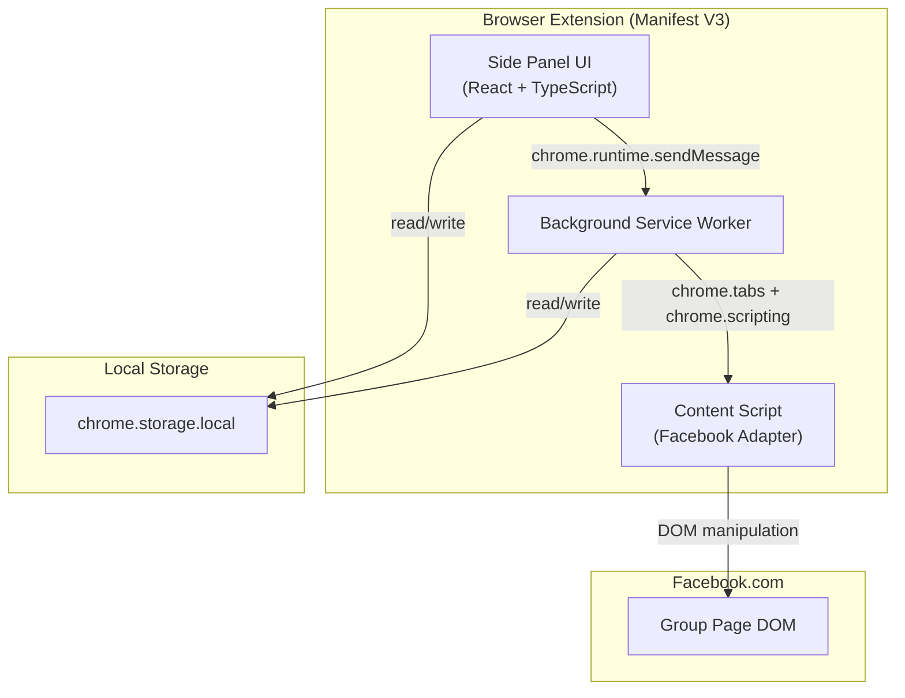

# Blink — Software Requirements Specification (SRS)

> **Version:** 1.0.0-draft  
> **Last Updated:** 2026-06-21  
> **Status:** Draft — awaiting stakeholder approval  

---

## 1. Project Overview

### 1.1 Product Name
**Blink** — A browser extension for automated multi-group social media posting.

### 1.2 Elevator Pitch
Blink lets a user compose a single post (text + images + videos), provide a list of Facebook group URLs, and have the extension sequentially navigate to each group and publish that post — all using the user's already-authenticated browser session. No APIs, no third-party tokens.

### 1.3 Key Principles
| Principle | Rationale |
|---|---|
| **No Meta API** | Meta deprecated the Groups API (April 2024). Blink uses browser-level DOM automation via content scripts. |
| **Local-first** | All data (posts, group lists, settings) stays on the user's machine via `chrome.storage.local`. |
| **Platform-agnostic architecture** | The core orchestration engine is decoupled from Facebook-specific logic so new platforms (LinkedIn, Reddit, etc.) can be added as "adapters." |
| **Human-like pacing** | Randomized delays and realistic input simulation to minimise detection risk. |

### 1.4 Target Browsers
| Browser | Priority | Notes |
|---|---|---|
| Google Chrome | **P0** — must work | Manifest V3, CRXJS build target |
| Microsoft Edge | P1 — should work | Chromium-based, near-identical MV3 support |
| Mozilla Firefox | P2 — nice to have | Uses `browser.*` namespace; requires WebExtension polyfill |

---

## 2. Architecture

### 2.1 High-Level Component Diagram



### 2.2 Component Responsibilities

#### 2.2.1 Side Panel UI (React + TypeScript)
- Persistent side panel (stays open during campaigns for live monitoring)
- Post composer (rich text area, media attachments)
- Group list manager (add/remove/import URLs, save/load named lists)
- Campaign launcher (start/pause/stop posting run)
- Status dashboard (progress, errors, logs)
- Settings page (delay ranges, retry policy)
- All icons via Lucide React (no emojis)

#### 2.2.2 Background Service Worker (`src/background/index.ts`)
- **Orchestrator**: Receives a "start campaign" message, iterates over the group list, opens/navigates tabs, injects content scripts, and collects results.
- **Scheduler**: Manages randomised delays between posts.
- **State Machine**: Tracks campaign state (`idle → running → paused → completed / failed`).
- **Storage Gateway**: Reads/writes campaign state to `chrome.storage.local` for crash recovery.

#### 2.2.3 Content Script — Facebook Adapter (`src/content-scripts/facebook/`)
- Detects the group page structure.
- Opens the post composer (Lexical-based rich text editor).
- Inserts text via simulated keyboard events (not `.value` assignment — React/Lexical ignores that).
- Attaches media files via a hidden `<input type="file">` trigger.
- Clicks the "Post" button.
- Reports success/failure back to the background worker.

### 2.3 Messaging Topology

```
SidePanel ──sendMessage──▸ Background ──chrome.tabs.sendMessage──▸ Content Script
                                ◂──response────────────────────────┘
```

All inter-component communication uses the **chrome.runtime messaging API** with typed message schemas.

---

## 3. Tech Stack

| Layer | Technology | Version (Pinned) |
|---|---|---|
| Language | TypeScript | ^5.5 |
| UI Framework | React | ^19.x |
| Build Tool | Vite + CRXJS | Vite 6.x, @crxjs/vite-plugin@latest |
| State Management | Zustand | ^5.x |
| Styling | Vanilla CSS (CSS Modules) | — |
| Icons | Lucide React | latest |
| Font | Inter (Google Fonts) | — |
| Testing (Unit) | Vitest | ^3.x |
| Testing (Component) | React Testing Library | ^16.x |
| Testing (E2E) | Playwright | ^1.x |
| Linting | ESLint + Prettier | latest |
| Package Manager | npm | ^10.x |

---

## 4. Feature Requirements (MVP)

### FR-01: Post Composer
| ID | Requirement | Priority |
|---|---|---|
| FR-01.1 | User can type/paste plain text for the post body | P0 |
| FR-01.2 | User can attach one or more images (jpg, png, gif, webp) | P0 |
| FR-01.3 | User can attach one or more videos (mp4, webm) | P0 |
| FR-01.4 | Preview panel shows a representation of the post before sending | P1 |
| FR-01.5 | Post body supports emoji input | P1 |

### FR-02: Group List Manager
| ID | Requirement | Priority |
|---|---|---|
| FR-02.1 | User can add group URLs manually (one per line or comma-separated) | P0 |
| FR-02.2 | User can remove individual URLs from the list | P0 |
| FR-02.3 | User can save a named group list locally | P0 |
| FR-02.4 | User can load a previously saved group list | P0 |
| FR-02.5 | User can delete a saved group list | P0 |
| FR-02.6 | URL validation — only accept `facebook.com/groups/…` patterns | P0 |
| FR-02.7 | Import group URLs from a CSV file | P1 (future) |
| FR-02.8 | Duplicate URL detection and deduplication | P1 |

### FR-03: Campaign Execution
| ID | Requirement | Priority |
|---|---|---|
| FR-03.1 | "Start Posting" initiates sequential posting to all groups in the list | P0 |
| FR-03.2 | Each post attempt uses the user's authenticated Facebook session | P0 |
| FR-03.3 | Random delay between posts (configurable range, default 30–60s) | P0 |
| FR-03.4 | Real-time progress indicator (X of Y posted, current group) | P0 |
| FR-03.5 | User can pause/resume a running campaign | P1 |
| FR-03.6 | User can cancel a running campaign | P0 |
| FR-03.7 | Failed posts are logged with error reason and can be retried | P1 |
| FR-03.8 | Campaign results summary at completion | P0 |

### FR-04: Settings
| ID | Requirement | Priority |
|---|---|---|
| FR-04.1 | Configurable min/max delay between posts (seconds) | P0 |
| FR-04.2 | Max retries per failed post | P1 |
| FR-04.3 | Enable/disable notification on campaign completion | P1 |

---

## 5. Data Models

### 5.1 Post Draft

```typescript
interface PostDraft {
  id: string;                    // UUID
  text: string;                  // Post body (plain text)
  mediaFiles: MediaFile[];       // Attached media
  createdAt: number;             // Unix timestamp
  updatedAt: number;
}

interface MediaFile {
  id: string;
  name: string;
  type: 'image' | 'video';
  mimeType: string;              // e.g. 'image/png'
  dataUrl: string;               // base64 data URL for storage
  sizeBytes: number;
}
```

### 5.2 Group List

```typescript
interface GroupList {
  id: string;                    // UUID
  name: string;                  // User-assigned label
  groups: GroupEntry[];
  createdAt: number;
  updatedAt: number;
}

interface GroupEntry {
  url: string;                   // Full Facebook group URL
  label?: string;                // Optional user-friendly name
  lastPostStatus?: 'success' | 'failed' | 'pending' | 'skipped';
  lastPostAt?: number;
}
```

### 5.3 Campaign State

```typescript
type CampaignStatus = 'idle' | 'running' | 'paused' | 'completed' | 'failed' | 'cancelled';

interface Campaign {
  id: string;
  postDraft: PostDraft;
  groupListId: string;
  status: CampaignStatus;
  currentIndex: number;          // Index into group list
  results: PostResult[];
  startedAt?: number;
  completedAt?: number;
  settings: CampaignSettings;
}

interface PostResult {
  groupUrl: string;
  status: 'success' | 'failed' | 'skipped';
  error?: string;
  timestamp: number;
}

interface CampaignSettings {
  delayMinSeconds: number;       // Default: 30
  delayMaxSeconds: number;       // Default: 60
  maxRetries: number;            // Default: 2
}
```

### 5.4 Message Protocol

```typescript
// Messages from Popup → Background
type PopupMessage =
  | { type: 'START_CAMPAIGN'; payload: { postDraft: PostDraft; groupListId: string; settings: CampaignSettings } }
  | { type: 'PAUSE_CAMPAIGN' }
  | { type: 'RESUME_CAMPAIGN' }
  | { type: 'CANCEL_CAMPAIGN' }
  | { type: 'GET_CAMPAIGN_STATUS' };

// Messages from Background → Content Script
type BackgroundToContentMessage =
  | { type: 'EXECUTE_POST'; payload: { text: string; mediaFiles: MediaFile[] } };

// Messages from Content Script → Background
type ContentToBackgroundMessage =
  | { type: 'POST_RESULT'; payload: PostResult };

// Messages from Background → Popup (via chrome.runtime.sendMessage or storage change listener)
type StatusUpdate = {
  type: 'CAMPAIGN_STATUS_UPDATE';
  payload: Campaign;
};
```

---

## 6. Content Script Strategy — Facebook Adapter

### 6.1 Why Not Use `.value` or `innerText`?
Facebook's post composer is built on **Lexical** (Meta's rich text framework), which uses a custom internal state model. Setting `.value` or `.textContent` on the editor element **will not** trigger React/Lexical state updates, so the text won't actually be part of the post payload when submitted.

### 6.2 Recommended Approach: Synthetic Keyboard Events
1. **Focus** the Lexical contenteditable `<div>`.
2. **Dispatch** `KeyboardEvent` + `InputEvent` sequences for each character:
   - `keydown` → `beforeinput` → `input` → `keyup`
   - Use `InputEvent` with `inputType: 'insertText'` and `data: char`.
3. **Pace** character insertion with small random delays (5–20ms) for realism.

### 6.3 Media Attachment Flow
1. Locate the photo/video button in the composer toolbar.
2. Programmatically click it to reveal the hidden `<input type="file">`.
3. Set the files on the input via `DataTransfer` + `dispatchEvent(new Event('change'))`.
4. Wait for the upload preview to render (DOM mutation observer).

### 6.4 Post Submission
1. Wait for the "Post" button to become enabled (not disabled/greyed out).
2. Click the "Post" button.
3. Wait for navigation or DOM confirmation that the post was submitted.

### 6.5 Resilience Patterns
- **Retry with backoff**: If a DOM element isn't found, retry up to N times with increasing delays.
- **MutationObserver**: Use observers instead of polling where possible.
- **Selector fallback chains**: Facebook's class names are obfuscated and change frequently. Use attribute selectors, ARIA roles, and text-content matching as primary selectors; fall back to structural selectors.

---

## 7. Expandability Contracts

### 7.1 Platform Adapter Interface

```typescript
/**
 * Every social platform implements this interface.
 * The orchestrator only interacts through this contract.
 */
interface PlatformAdapter {
  /** Unique platform identifier */
  readonly platformId: string; // e.g. 'facebook', 'linkedin'

  /** Human-readable name */
  readonly platformName: string;

  /** Validates that a URL belongs to this platform */
  isValidGroupUrl(url: string): boolean;

  /** 
   * Executes a post on the given group page.
   * Assumes the content script is already injected on the correct page.
   * Returns a PostResult.
   */
  executePost(post: PostDraft): Promise<PostResult>;

  /** 
   * Detects whether the current page is a valid group page for this platform.
   */
  detectGroupPage(): boolean;
}
```

### 7.2 Adding a New Platform (Checklist)
1. Create `src/content-scripts/<platform>/adapter.ts` implementing `PlatformAdapter`.
2. Register the adapter in `src/content-scripts/registry.ts`.
3. Add URL pattern matching in the manifest's `content_scripts` or use programmatic injection.
4. Add platform-specific selectors and interaction logic.
5. Write integration tests for the new adapter.

### 7.3 CSV Import (Future)
- Parse CSV with columns: `url`, `label` (optional).
- Validate each row against registered platform adapters.
- Merge/deduplicate with existing group list.

---

## 8. Project Structure

```
blink/
├── public/
│   └── icons/                    # Extension icons (16, 32, 48, 128)
├── src/
│   ├── sidepanel/                # Side Panel UI (React app)
│   │   ├── App.tsx
│   │   ├── components/
│   │   │   ├── PostComposer/
│   │   │   │   ├── PostComposer.tsx
│   │   │   │   ├── PostComposer.module.css
│   │   │   │   ├── MediaUploader.tsx
│   │   │   │   └── PostPreview.tsx
│   │   │   ├── GroupManager/
│   │   │   │   ├── GroupManager.tsx
│   │   │   │   ├── GroupManager.module.css
│   │   │   │   ├── GroupListEditor.tsx
│   │   │   │   ├── GroupUrlInput.tsx
│   │   │   │   └── SavedLists.tsx
│   │   │   ├── CampaignDashboard/
│   │   │   │   ├── CampaignDashboard.tsx
│   │   │   │   ├── CampaignDashboard.module.css
│   │   │   │   ├── ProgressTracker.tsx
│   │   │   │   └── ResultsSummary.tsx
│   │   │   ├── Settings/
│   │   │   │   ├── Settings.tsx
│   │   │   │   └── Settings.module.css
│   │   │   └── shared/
│   │   │       ├── Button.tsx
│   │   │       ├── Modal.tsx
│   │   │       ├── Toast.tsx
│   │   │       └── Layout.tsx
│   │   ├── hooks/
│   │   │   ├── useStorage.ts
│   │   │   ├── useCampaign.ts
│   │   │   └── useGroupLists.ts
│   │   ├── store/
│   │   │   ├── postStore.ts
│   │   │   ├── groupStore.ts
│   │   │   └── campaignStore.ts
│   │   ├── styles/
│   │   │   ├── global.css
│   │   │   ├── variables.css
│   │   │   └── animations.css
│   │   └── index.tsx
│   ├── background/
│   │   ├── index.ts               # Service worker entry
│   │   ├── orchestrator.ts         # Campaign execution engine
│   │   ├── scheduler.ts            # Delay/timing logic
│   │   └── storage.ts              # chrome.storage helpers
│   ├── content-scripts/
│   │   ├── facebook/
│   │   │   ├── adapter.ts          # PlatformAdapter implementation
│   │   │   ├── selectors.ts        # DOM selector strategies
│   │   │   ├── composer.ts         # Post composer interaction
│   │   │   └── detector.ts         # Page detection logic
│   │   └── registry.ts             # Platform adapter registry
│   ├── shared/
│   │   ├── types.ts                # Shared TypeScript interfaces
│   │   ├── messages.ts             # Message type definitions
│   │   ├── validators.ts           # URL validation, etc.
│   │   ├── constants.ts            # Magic numbers, config defaults
│   │   └── utils.ts                # Shared utility functions
│   └── manifest.json               # Manifest V3 config
├── tests/
│   ├── unit/
│   │   ├── validators.test.ts
│   │   ├── scheduler.test.ts
│   │   ├── orchestrator.test.ts
│   │   └── storage.test.ts
│   ├── component/
│   │   ├── PostComposer.test.tsx
│   │   ├── GroupManager.test.tsx
│   │   └── CampaignDashboard.test.tsx
│   └── e2e/
│       └── campaign-flow.spec.ts
├── vite.config.ts
├── tsconfig.json
├── package.json
└── README.md
```

---

## 9. Manifest V3 Configuration

```json
{
  "manifest_version": 3,
  "name": "Blink — Multi-Group Poster",
  "version": "1.0.0",
  "description": "Compose once, post to many Facebook groups automatically.",
  "permissions": [
    "storage",
    "activeTab",
    "scripting",
    "tabs"
  ],
  "host_permissions": [
    "https://*.facebook.com/*"
  ],
  "side_panel": {
    "default_path": "src/sidepanel/index.html"
  },
  "action": {
    "default_title": "Open Blink",
    "default_icon": {
      "16": "public/icons/icon-16.png",
      "32": "public/icons/icon-32.png",
      "48": "public/icons/icon-48.png",
      "128": "public/icons/icon-128.png"
    }
  },
  "background": {
    "service_worker": "src/background/index.ts",
    "type": "module"
  },
  "content_scripts": [
    {
      "matches": ["https://*.facebook.com/groups/*"],
      "js": ["src/content-scripts/facebook/adapter.ts"],
      "run_at": "document_idle"
    }
  ],
  "icons": {
    "16": "public/icons/icon-16.png",
    "32": "public/icons/icon-32.png",
    "48": "public/icons/icon-48.png",
    "128": "public/icons/icon-128.png"
  }
}
```

---

## 10. Testing Strategy

### 10.1 Unit Tests (Vitest)
| Module | What to Test |
|---|---|
| `validators.ts` | URL validation, group URL parsing, input sanitisation |
| `scheduler.ts` | Random delay generation, range boundary checks |
| `orchestrator.ts` | State machine transitions, error handling, retry logic |
| `storage.ts` | CRUD operations on group lists, post drafts, campaigns |
| `messages.ts` | Message serialisation/deserialisation |

### 10.2 Component Tests (React Testing Library + Vitest)
| Component | What to Test |
|---|---|
| `PostComposer` | Text input, media attachment, preview rendering |
| `GroupManager` | Add/remove URLs, save/load lists, validation feedback |
| `CampaignDashboard` | Progress display, status transitions, result summary |
| `Settings` | Input constraints, persistence |

### 10.3 Integration / E2E Tests (Playwright)
| Scenario | What to Test |
|---|---|
| Full campaign flow | Compose post → add groups → start → verify completion |
| Group list persistence | Save list → close popup → reopen → list is restored |
| Error recovery | Simulate failed post → verify retry → verify error log |

---

## 11. Non-Functional Requirements

| Category | Requirement |
|---|---|
| **Performance** | Side panel should render in < 200ms. Content script injection < 500ms. |
| **Storage** | Total extension storage should not exceed 50MB (chrome.storage.local limit is ~10MB for synced, unlimited for local). |
| **Security** | No data leaves the browser. No external API calls. No analytics/telemetry. |
| **Accessibility** | Side panel UI must be keyboard-navigable. ARIA labels on interactive elements. |
| **Resilience** | Campaign state persisted to storage — survives browser restart. |
| **Logging** | All content script actions logged with timestamps for debugging. |

---

## 12. Known Constraints & Risks

| Risk | Impact | Mitigation |
|---|---|---|
| Facebook DOM changes | Content script breaks | Selector fallback chains, frequent test runs against live FB, version-pinned selector configs |
| Account restrictions ("Facebook Jail") | User's account gets temporarily banned | Randomised delays, daily post limits, user warnings in UI |
| Large media files | Exceed storage limits, slow transfers | Compress images before storage, stream videos, size limit warnings |
| Service worker lifecycle | MV3 service workers can be killed after 5 min of inactivity | Persist state to storage, use `chrome.alarms` for keep-alive during campaigns |
| Cross-browser compat | Firefox uses `browser.*` namespace | Use `webextension-polyfill` library |

---

## 13. Glossary

| Term | Definition |
|---|---|
| **Campaign** | A single run of posting the same content to a list of groups |
| **Adapter** | A platform-specific content script module that implements `PlatformAdapter` |
| **Orchestrator** | The background service worker logic that manages campaign execution |
| **Group List** | A named, saved collection of social media group URLs |
| **Lexical** | Meta's open-source rich text editor framework used in Facebook's post composer |

---

## 14. Future Roadmap (Post-MVP)

| Feature | Priority |
|---|---|
| CSV import for group URLs | P1 |
| LinkedIn platform adapter | P2 |
| Reddit platform adapter | P2 |
| Post scheduling (post at a specific time) | P2 |
| Spintax support (text variation per post) | P2 |
| Campaign history and analytics | P2 |
| Post templates library | P3 |
| Bulk media management | P3 |
